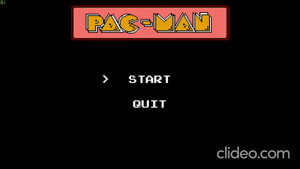
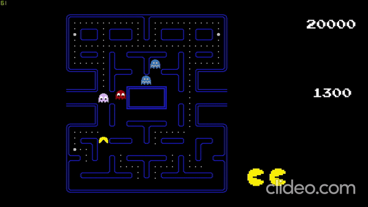

# Pacman-Clone

This is a Pacman clone, developed with the [Unity 2D](https://unity.com/) game engine. I've developed the project to improve my coding skills.
It's one of the best ways to practice.
Four Different Mode For Enemy.
Coroutine System

#

<table><tr><td align="center"><a href="https://github.com/cemerdemdeniz">  <b>Cem Erdem Deniz</b></a> </td></tr></table>  

## Screenshots

